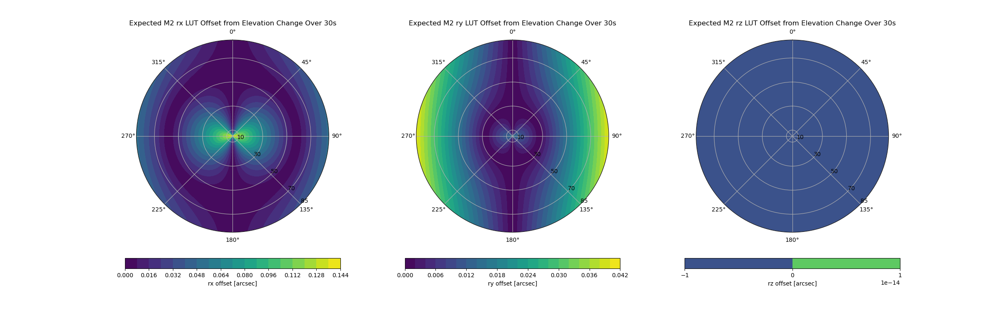

###############################
Hexapod motions while exposing.
###############################

.. abstract::

   We have had many discussions about the pros and cons of intentionally moving the M2 and Camera hexapods while the camera shutter is open.  This technote attempts to capture the pros and cons, and document the data that has been generated.

Why move the hexapods during the exposure?
===============================================

At first glance, one would think that we should not be moving the hexapods while the shutter is open, in order to minimize motions of the camera that might cause image jitter.  However, the Camera and M2 hexapod Look-Up Tables (LUTs) in some cases recommend significant hexapod motion during the exposure to keep the telescope in the optimum position for image quality.  However, it is important to note that these LUTs were generated to optimize image quality, and did not take into account whether the image had moved slightly between the exposures used to generate the LUTs.  Figures 1-4, generated by Guillem Megias, show the amount of hexapod motion recommended by the LUTs during a 30 second exposure as a function of location on the sky.  These are just from the elevation LUT, but we think this is the main source of changes while exposing.  You can see that while many of the recommended changes are quite small, especially the Camera Y change can be as much as 10 microns.

.. image:: ./_static/Camera_XYZ_Change.png

Figure 1. Camera altitude XYZ LUT change during a 30 second exposure. 

Figure 2. Camera altitude RXRYRZ LUT change during a 30 second exposure. 

Figure 3. M2 altitude XYZ LUT change during a 30 second exposure. 

Figure 4. M2 altitude RXRYRZ LUT change during a 30 second exposure. 

Size of hexapod motion steps
===============================================

The hexapod motions do not move continuously, but accumulate an error and then move in a step when the accumulated error exceeds some threshold.  Initially, this threshold was set at 20 microns.  With this threshold, we saw some images with essentially no hexapod motions, and some images with large, 20 micron steps, as in Figures 5 and 6.  This threshold was then changed to 1 micron.  After this, all exposures have a series of small hexapod steps, as in Figure 7.

Figure 5. Exposure with essentially zero hexapod motions.

Figure 6. Exposure with a 20 micron hexapod step.

Figure 7. Exposure with a series of 1 micron hexapod steps. It is not understood (at least by the author) why the steps have different sizes.

Test to see if hexapod motions during exposure are necessary.
=============================================================

In an attempt to determine if it is necessary or desirable to move the hexapods while exposing, Elana Urbach designed a test (BLOCK-T558), which was run on 20250717.  The details are below.

      -  The current standard is to move the hexapods in 1 micron steps
         while exposing.

      -  This test increased that step size to 20 microns.

      -  This gives some images with no hexapod motion (what we want to
         test) and some with 20 micron hexapod steps (which we ignore).

      -  The tests were done near 270 degrees azimuth to give maximum
         elevation motion.

Figures 8, 9, and 10 compare different aspects between an image with no hexapod motions and an image with 1 micron hexapod steps.

.. image:: ./_static/lsstcam_mount_2025-07-17_000344.png
    :width: 49 %

Figure 8. Comparing the mount motion plots between no significant hexapod motion (left) and 1 micron hexapod steps (right).	    
	    

Figure 9. Comparing the FWHM focal plane plots between no significant hexapod motion (left) and 1 micron hexapod steps (right).	    
	    

Figure 10. Comparing the star image plots between no significant hexapod motion (left) and 1 micron hexapod steps (right).	    
	    
One other point from this test.  The best image during the test (Figures 11, 12, 13) occurred with no hexapod motions.  Thus it appears that no hexapod motions are necessary to obtain good imaging.  However, we believe this test was not sufficiently conclusive to make a decision, and we plan to repeat it with better seeing.

	   
Figure 11. Mount motion plot of the best image, which had no hexapod motion.
	    

Figure 12. FWHM focal plane plot of the best image, which had no hexapod motion.

Figure 13. Star image plot of the best image, which had no hexapod motion.

Images with large hexapod motions while exposing.
=============================================================

We are seeing many images where the hexapod motions during exposure are much larger than intended. During the week from 2025-07-16 to 2025-07-23, there were 22 images flagged for this issue.  Figures 14 and 15 show one of these images, and I have plots of all of them.  Also Figure 16 show the event timeline for this image.  Since there are many hexapod motions occurring during the exposure by design, it is hard to tell which ones are much larger than intended.

	   
Figure 14. Mount motion plot of an image with large hexapod motions.
	    

Figure 15. Witness detector from the image with large hexapod motions.

Figure 16. Event timeline plot from the image with large hexapod motions.  You can see in the lower right that there are many events where the hexapod is moving (by design) so it is hard to tell when it is moving more than intended.

It was thought that these events might be due to equipment faults.  To test this, I looked in more detail at two of the events, as shown in Figures 17 and 18.  Below each figure is a time line of events.  The one in Figure 17 did have a fault, but it occurred 40 seconds after the image.  The one in Figure 18 had no faults within faults +/- 4 minutes of the image in MTMount, MTPtg, MTAOS, MTHexapod, or MTCamera.  So it appears that faults are not an explanation. 

Figure 17. Large hexapod motion fail 2025071600177, looking at just M2 hexapod X motion.  The motions are clearly being commanded. A fault occurred on this image, but it occurred 40 seconds after the end of the image.

.. code-block:: text

		[100346] - [Done] - [TrackTargetAndTakeImageLSSTCam]
		band_filter: g_6 - This is the last g_6 image – seqNum 176
		2025-07-17T00:03:52.127488 - SeqNum 176 shutter open from Butler 
		2025-07-17T00:04:23.08 - INFO - Setting final state to <ScriptState.DONE: 8> 
		2025-07-17T00:04:23.058000 - SeqNum 176 shutter close from Butler 

		[100347] - [Done] - [TrackTargetAndTakeImageLSSTCam]
		band_filter: i_39 - This is the first  i_39 image – seqNum 177
		2025-07-17T00:06:13.82 - INFO - Filter i_39 in position. 
		2025-07-17T00:06:23.392409 -  SeqNum 177 shutter open from Butler 
		2025-07-17T00:06:54.35 - INFO - Setting final state to <ScriptState.DONE: 8>
		2025-07-17T00:06:54.323000 - SeqNum 177 shutter close from Butler 

		[100348] - [Failed] - [TrackTargetAndTakeImageLSSTCam]
		2025-07-17T00:07:36.06 - WARN - mthexapod_2 not in <State.ENABLED: 2>: <State.FAULT: 3> 
		2025-07-17 00:07:36.051410+00:00 – M2Hex enters fault state from EFD. 

Figure 18. Large hexapod motion fail 2025071600479, looking at just M2 hexapod X motion.  The motions are clearly being commanded.  No faults were found for this image.

.. code-block:: text

		[100695] - [Done] - [TrackTargetAndTakeImageLSSTCam] 
		band_filter: r_57 - This is the last r_57 image – seqNum 478
		2025-07-17T06:34:52.152644 - SeqNum 478 shutter open from Butler 
		2025-07-17T06:35:23.14 - INFO  - Setting final state to <ScriptState.DONE: 8> 
		2025-07-17T06:35:23.094000 - SeqNum 478 shutter close from Butler 

		[100696] - [Done] - [TrackTargetAndTakeImageLSSTCam] 
		band_filter: u_24 - This is the first  u_24 image – seqNum 479
		2025-07-17T06:37:20.15 - INFO  - Filter u_24 in position.
		2025-07-17T06:37:25.480076 -  SeqNum 479  shutter open from Butler 
		2025-07-17T06:38:04.43 - INFO  - Setting final state to <ScriptState.DONE: 8> 
		2025-07-17T06:38:04.411000 - SeqNum 479 shutter close from Butler 

Summary
====================

I attempted to summarize here the discussions and tests as to whether or not we should be moving the hexapods while exposing.  Whether or not we continue moving the hexapods during exposures, we need to solve the problem where the hexapods sometimes move far more than intended.  Comments and discussions are welcome.
